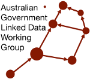

# AGLDWG Documents
This repository holds the important documents of the [Australian Government Linked Data Worling Group (AGLDWG)](https://www.linked.data.gov.au/).

The documents, in pure text and original PDF forms:

* [Current Terms of Reference](ToR.md)
   * of the Working Group
   * [original PDF](ToR.pdf)
* [Current Memorandum of Understanding](MoU.md)
    * about the management of the `linked.data.gov.au` domain name
    * [original PDF](MoU.pdf)

The next generation of AGLDWG documents are:

* [Terms of Reference v2](ToR.md)
* [Memorandum of Understanding v2](MoU.md)

_**NOTE**: these next generation documents are currently still being revised (until this notice is removed) so these "v2" versions are drafts only._

## More information

Please contact the Working Group directly for more information via

* [our website's contact page](https://www.linked.data.gov.au/contact)
